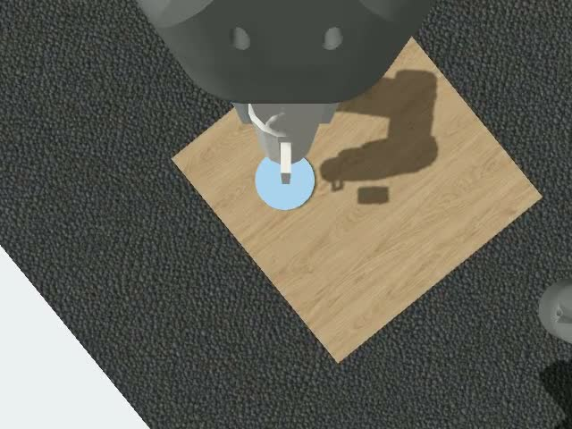

# Cup Arrangement

Cup Arrangement is a ROS 2 and Gazebo research project for picking up a handled
cup with a UR5e arm and Robotiq Hand-E gripper, placing it on a plate, and
releasing it through simulated contact. It includes a configurable tabletop
scene, robot controllers, demonstration recording tools, and imitation-learning
experiments using wrist-camera images and measured joint positions.

The contact-based expert and a recorded position-reference replay have completed
the task in simulation. **Learned autonomous pickup and placement are not yet
validated.** Starting the simulator below loads the scene and controllers; it
does not start a trained policy or an automatic cup-pickup demonstration.
See [experiment results](docs/EXPERIMENTS.md) for the distinction.

## Expert demonstration

[](assets/demo/expert-cup-placement.mp4)

**[Watch or download the expert demonstration (MP4, 48.5 seconds, 4.8 MiB)](https://github.com/BuckeyeAutonomousRobots/Cup_Arrangement/raw/refs/heads/main/assets/demo/expert-cup-placement.mp4).**
Wrist-camera view of an expert position-reference replay: approach, grasp, lift,
place on the plate, and release. Playback follows simulation time. This is an
**expert demonstration**, not a learned-policy result. The recording uses the
original textured scene; the included scene uses solid-color materials.
[Recording details and attribution](assets/demo/README.md).

## Run locally

Choose your operating system, then follow the shared build steps:

- [Linux prerequisites](#linux-prerequisites)
- [Windows prerequisites: WSL 2](#windows-prerequisites-wsl-2)
- [Build and launch](#build-and-launch)
- [Check, test and stop](#check-test-and-stop)
- [Optional desktop and GPU rendering](#optional-desktop-and-gpu-rendering)

For a separate Linux workstation or server, use the
[remote Linux README](docs/remote/README.md).

The intended local targets are x86-64 Ubuntu 22.04/24.04 and Windows 11 with an
Ubuntu WSL 2 environment. ROS 2 Humble and Gazebo Fortress run inside Docker;
you do not need host ROS or Gazebo. Native Windows and macOS simulation are not
covered by these instructions. ARM hosts have not been validated.

**Validation:** source checks, launcher tests and Compose configuration checks
pass. A clean image build and live launch of this checkout have not yet been
verified on Linux or Windows/WSL 2. The commands below are checked against the
source; they are not a claim of a tested Windows installation.
See [validation details](docs/VALIDATION.md).

### Linux prerequisites

Use Ubuntu 22.04 or 24.04 with Bash, Git, Python 3 and PyYAML:

```bash
sudo apt-get update
sudo apt-get install -y git python3 python3-yaml
```

Install Docker Engine, Buildx and the Compose plugin using Docker's
[Ubuntu installation guide](https://docs.docker.com/engine/install/ubuntu/).
The account running this project must be able to run `docker info` successfully.
Use Compose 2.30 or newer if enabling the optional GPU configuration, which uses
[`gpus: all`](https://docs.docker.com/reference/compose-file/services/#gpus).

Allow room for the ROS image and build artifacts. A practical starting allocation
is 16 GB RAM and 30 GB free disk; these are planning estimates, not measured
minimum requirements. The initial CPU/headless setup does not require an NVIDIA
GPU and leaves image capture disabled.

### Windows prerequisites: WSL 2

Use a supported Windows 11 x86-64 release with hardware virtualization enabled
and a current WSL installation. Check Docker's current
[Windows requirements](https://docs.docker.com/desktop/setup/install/windows-install/)
before installing Docker Desktop.

In **PowerShell as Administrator**, install Ubuntu through WSL:

```powershell
wsl --install -d Ubuntu-24.04
```

Restart if prompted, open Ubuntu, and create your Linux user account. If that
distribution name is unavailable, use `wsl --list --online` to select Ubuntu
22.04 or 24.04. See Microsoft's [WSL installation guide](https://learn.microsoft.com/en-us/windows/wsl/install).

In **PowerShell**, update WSL and check that Ubuntu reports `VERSION 2`:

```powershell
wsl --update
wsl --version
wsl --list --verbose
```

Install and start **Docker Desktop for Windows**. Enable its WSL 2 engine and
Ubuntu under **Settings → Resources → WSL Integration**. Use Linux containers.
Do not install a second Docker Engine inside Ubuntu when using this route.
Docker documents these settings in its [WSL guide](https://docs.docker.com/desktop/features/wsl/).

Open the **Ubuntu terminal** and install the host-side tools:

```bash
sudo apt-get update
sudo apt-get install -y git python3 python3-yaml
```

Run every remaining Bash block in Ubuntu, not PowerShell. Clone into your Linux
home directory (`~/src`), rather than `/mnt/c`, to preserve Linux filesystem
behavior and improve build performance. See Microsoft's
[filesystem guidance](https://learn.microsoft.com/en-us/windows/wsl/filesystems).
Keep Docker Desktop running while using the simulator.

### Build and launch

Use a **Linux or WSL Ubuntu terminal**. First verify Docker access:

```bash
docker info
docker compose version
python3 -c 'import yaml; print("PyYAML available")'
```

`docker info` must show a reachable server without a permission error. Clone and
configure a new checkout:

```bash
mkdir -p ~/src
cd ~/src
git clone https://github.com/BuckeyeAutonomousRobots/Cup_Arrangement.git
cd Cup_Arrangement
cp config/hosting.env.example .hosting.env
cp ros_backend1.1/.env.example ros_backend1.1/.env
sed -i 's/^ENABLE_GRIPPER_CAMERA=.*/ENABLE_GRIPPER_CAMERA=0/' ros_backend1.1/.env
python3 tools/capstone.py config
python3 tools/capstone.py up --dry-run
```

The configuration should show `CAPSTONE_MODE=local`, `CAPSTONE_GPU=0` and
`CAPSTONE_VIEWER=0`. The dry run prints a local lifecycle command, without SSH.
The camera is disabled explicitly for the first CPU/headless run; camera-based
learning requires a working renderer and is a separate step below. Do not
recopy the example files over settings you have already customized.

Build the image, compile the ROS workspace, then start the scene:

```bash
python3 tools/capstone.py doctor
python3 tools/capstone.py build-image
python3 tools/capstone.py build-workspace
python3 tools/capstone.py up
```

`doctor` reports only the Compose version; it does not test daemon access.
`build-image` also starts the container. `build-workspace` should finish with
`[ok] Built workspace packages:`. `up` generates the world from the active
`baseline_v1` scene profile, starts Gazebo and the controllers, and prints
`[ok] Started dual-arm Gazebo tabletop scaffold` before the remaining node logs.
There is no desktop window in this headless configuration.

### Check, test and stop

From the repository root in the same Linux/Ubuntu terminal:

```bash
python3 tools/capstone.py status
docker exec bar_cup_arrangement_backend bash -lc \
  'source /workspace/install/setup.bash && ros2 topic echo /clock --once'
docker exec bar_cup_arrangement_backend bash -lc \
  'source /workspace/install/setup.bash && ros2 control list_controllers -c /right_controller_manager'
```

Expect a running `bar_cup_arrangement_backend` container, a simulation clock
message, and active right-arm joint-state, velocity and gripper controllers.
These checks confirm basic startup, not successful manipulation. Use your own
container name if you changed `CAPSTONE_CONTAINER`.

Run the launcher tests without ROS, and the backend tests after building:

```bash
PYTHONDONTWRITEBYTECODE=1 python3 -m unittest discover -s tools -p 'test_*.py' -v
docker exec bar_cup_arrangement_backend bash -lc \
  'source /workspace/install/setup.bash && cd /workspace && python3 -m pytest -q -p no:cacheprovider tests'
```

For syntax checks on a **fresh checkout before creating `.env` files or generated
outputs**, run `python3 tools/validate_source.py`. Its artifact scan intentionally
rejects local configuration and generated data.

Stop and remove this project's container with:

```bash
python3 tools/capstone.py down
```

The image and bind-mounted source remain. Container-only build output and logs
are removed, so copy any logs you need before stopping. On the next start,
`python3 tools/capstone.py up` recreates the container and builds missing workspace
packages. To rebuild after dependency changes, repeat `build-image`,
`build-workspace`, then `up`. Do not use `down` while an experiment is active.

### Optional desktop and GPU rendering

For a browser desktop, change `CAPSTONE_VIEWER=1` in `.hosting.env` before
starting. Open `http://127.0.0.1:6080/vnc.html` in your browser. This enables an
Xvfb/noVNC desktop; the simulator server still runs headlessly. On a CPU setup,
start the separate Gazebo viewer after `up`:

```bash
CONTAINER=bar_cup_arrangement_backend bash ros_backend1.1/scripts/gpu_viewer.sh start
```

Despite its filename, this helper starts a software-rendered inspection GUI;
it does not enable GPU physics or camera rendering. Software graphics can be
slow or fail if the available OpenGL implementation is insufficient. A blank
desktop alone does not mean the simulation stopped. Container display access
uses noVNC; these instructions do not depend on WSLg forwarding.

For **native Linux NVIDIA rendering**, first install a compatible driver and
[NVIDIA Container Toolkit](https://docs.nvidia.com/datacenter/cloud-native/container-toolkit/latest/install-guide.html)
and verify Docker GPU access. Set `CAPSTONE_GPU=1` in `.hosting.env` and
`ENABLE_GRIPPER_CAMERA=1` in `ros_backend1.1/.env`. The GPU configuration uses
Ogre2/EGL for server-side rendering. With `CAPSTONE_VIEWER=1`, `up` also starts
the separate inspection viewer. To keep the GPU server headless with the
desktop disabled, launch with:

```bash
ENABLE_VIEWER=0 python3 tools/capstone.py up
```

Windows GPU support requires the Docker Desktop WSL 2 backend and a compatible
NVIDIA Windows driver; follow [Docker's GPU guide](https://docs.docker.com/desktop/features/gpu/).
CUDA availability alone does not establish that this project's Ogre2/EGL camera
path works under WSL 2. That path is unverified; start with CPU/headless mode or
use the [remote Linux guide](docs/remote/README.md) for a Linux GPU host.

### Troubleshooting

| Symptom | What to check |
|---|---|
| Cannot connect to Docker | Run `docker info`. On Windows, start Docker Desktop and enable Ubuntu integration. On Linux, check the daemon and your account's Docker access. |
| `No module named yaml` | Install `python3-yaml` in the Linux/WSL shell running the launcher. The world generator runs on the host. |
| Port or container name already in use | Choose unique project/container names and viewer port in `.hosting.env`; change ROS-TCP/Quest host ports in `ros_backend1.1/.env`. Keep published services loopback-bound. |
| Build killed or disk full | Check Docker/WSL memory and disk allocation. Build output lives inside the container. |
| Camera or EGL/OpenGL failure | Return to CPU/headless mode with the camera disabled. Inspect `/tmp/gz_dual_arm_tabletop.log` inside the container before trying graphics again. |
| Startup times out or controllers are missing | Inspect the launch log below; verify `build-workspace` succeeded. Do not interpret a running container as a healthy simulator. |
| Permission or line-ending errors on Windows | Clone using Git inside Ubuntu under `~/src`; preserve LF endings and Linux file permissions. |

Read startup logs before removing the container:

```bash
docker exec bar_cup_arrangement_backend tail -n 80 /tmp/run_dual_arm_tabletop_sim.log
docker exec bar_cup_arrangement_backend tail -n 80 /tmp/gz_dual_arm_tabletop.log
```

## Project structure and learning experiments

| Path | Purpose |
|---|---|
| `ros_backend1.1/` | Docker environment, scene profiles, robot controllers, recording and tests |
| `models/baseline_v1/` | Contact-based expert and initial behavior-cloning tools |
| `models/act_v1/` | Causal dataset adapter, ACT training and analysis |
| `models/policy100/` | Position-target contracts and policy comparisons |
| `requirements/` | Recorded learning-environment package versions |
| `tools/` | Local/remote launcher and source checks |

The simulator can be built from this repository. Reproducing learning experiments
also requires demonstration recordings, caches and checkpoints, which are not
included. The expert uses object ground truth; learned policies use wrist RGB
and measured joints. See [data requirements](docs/DATA_AND_REPRODUCTION.md) and
[learning setup](docs/SETUP.md). The documented workflow is simulation-only.

## Attribution and licensing

Source history and upstream attribution are recorded in
[PROVENANCE.md](docs/PROVENANCE.md). Existing third-party licenses and credits
are retained in [THIRD_PARTY_NOTICES.md](THIRD_PARTY_NOTICES.md). A repository-wide
license has not yet been selected.
